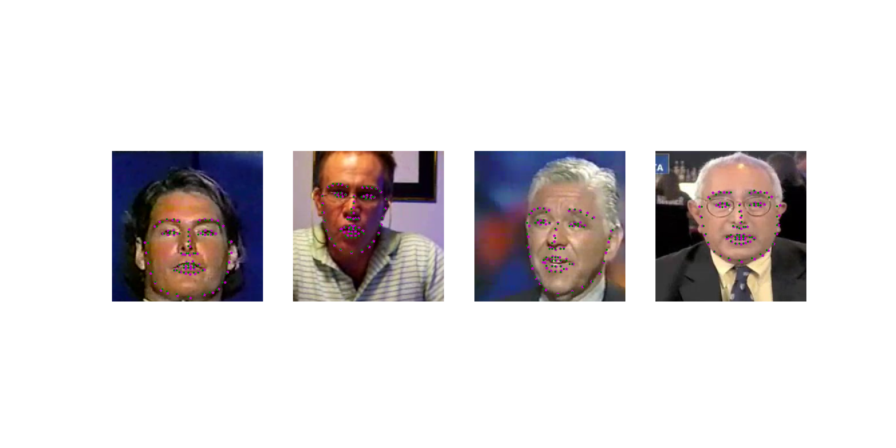
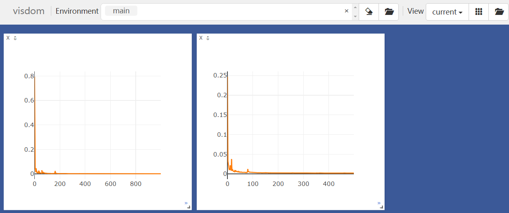

# Facial landmarks detection using PyTorch

### Environment 
   pytorch, visdom

## Download the data

    wget -P ./data/ https://s3.amazonaws.com/video.udacity-data.com/topher/2018/May/5aea1b91_train-test-data/train-test-data.zip
    cd data 
    unzip train-test-data.zip
##  training 
    python -m visdom.server
    python main.py 
##  testing   
    python demo.py 

## loss
 train loss vs val loss

